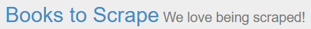

# Projet 2 : Analyse de marché
  
</img>

## Introduction

Cette application a pour but d'aller collecter des informations sur les livres présents sur le site [Books To Scrape](https://books.toscrape.com/index.html)  

## Getting started

### Packages utilisés

- BeautifulSoup4
- requests
- csv
- os

### Environnement virtuel

Dans le dossier du projet, taper les commandes suivantes dans une fenêtre powershell

#### Création

Création de l'environnement virtuel

Remplacer :  
- \<version> par la version de votre python
- <nom_de_l_environnement_virtuel> par le nom souhaité

```
python<version> -m venv <nom_de_l_environnement_virtuel>
```

#### Activation

Activation de l'environnement virtuel

```
<nom_de_l_environnement_virtuel>/Scripts/activate
```

#### Packages

Installation des packages nécessaires pour le fonctionnement du script

```
pip install -r .\requirements.txt
```

## Utilisation

Lancer le script et patienter 😁

Remplacer \<version> par la version de votre python
```
python<version> main.py
```

## Etape du script

1. Scruter le site internet à la recherche des différentes catégories de livres
2. Pour chaque catégorie, aller chercher les différentes informations demandées et les enrtegsitrées dans un dossier "csv" dans un fichier .csv par catégorie
3. Téléchargement des couvertures de chaque livres dans un dossier "/images/*nom_de_la_categorie/*"

## Informations collectées

- product_page_url : lien de la page du liuvre
- universal_product_code (upc) : code du produit
- title : titre du livre
- price_including_tax : prix avec taxes
- price_excluding_tax : prix hors taxe
- number_available : nombre de livres disponibles
- product_description : résumé du livre
- category : catégorie
- review_rating : note du livre sur 5
- image_url : lien de l'image

## Limitations

Ce script se limite au site indiqué dans l'introduction